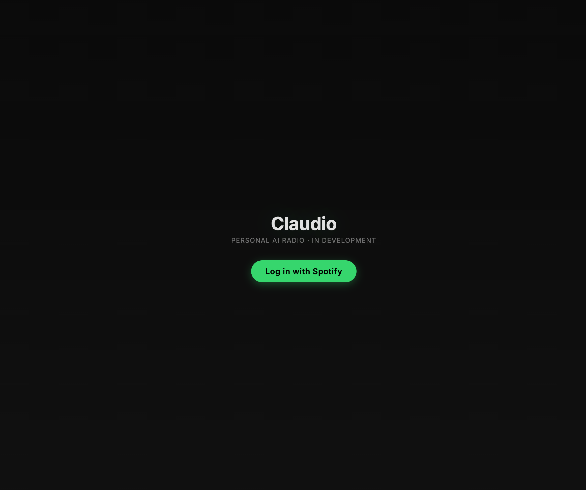
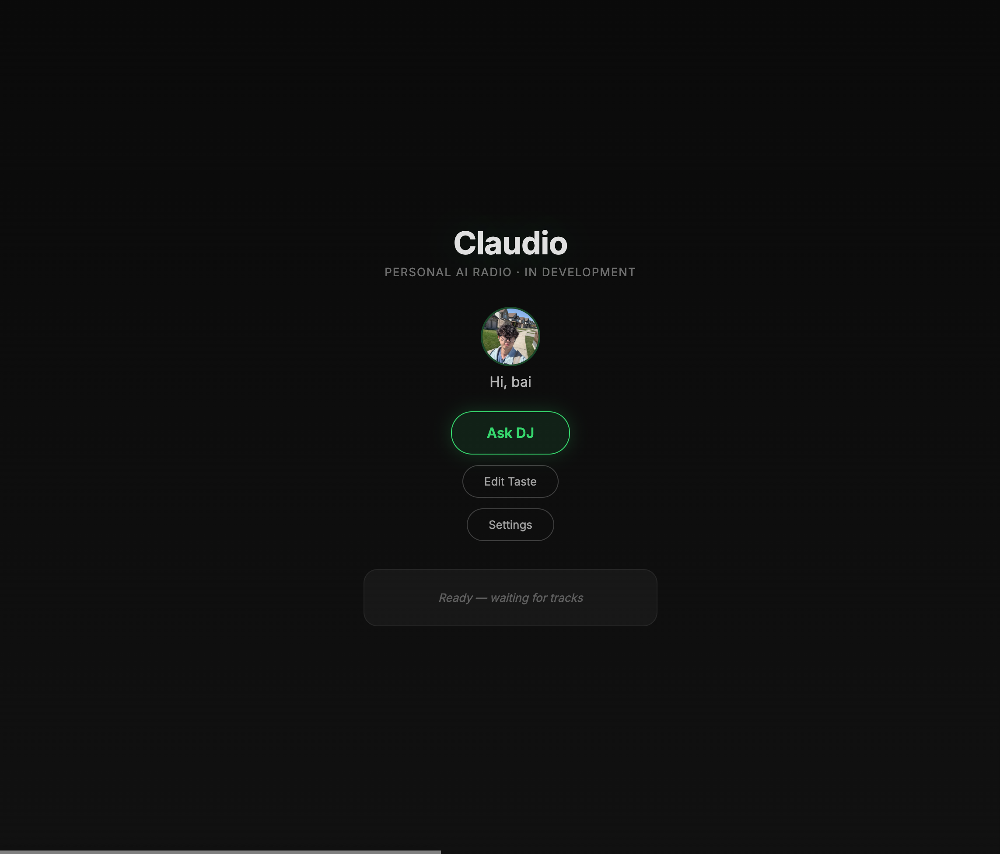
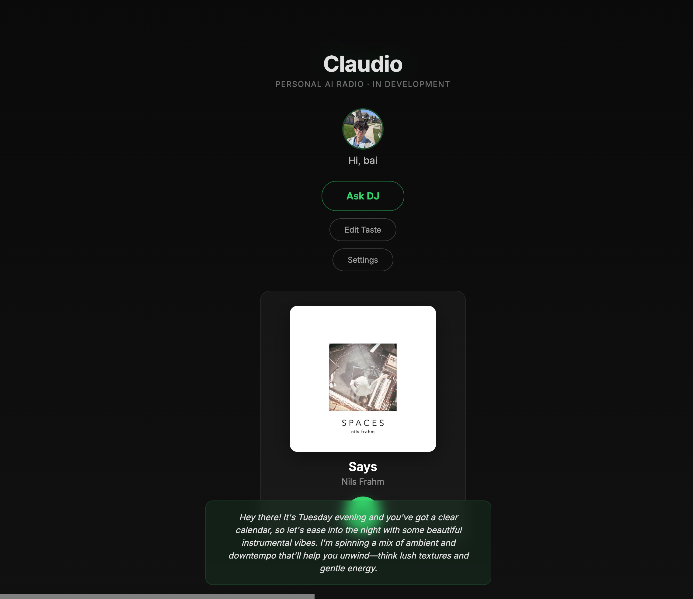

# Claudio 🎙️

> Personal AI radio that learns your listening habits and curates music like a DJ.

[](./LICENSE)
[](#)
[](#prerequisites)

**[Try it live →](https://claudio-k7bd.onrender.com)**

---

## What is Claudio?

Most music apps recommend tracks. **Claudio runs a radio station for you.**

It reads your calendar, checks the weather, and reviews what you've been
listening to. Then it builds a playlist for your day, writes a DJ intro in
your preferred style, speaks it out loud, and queues the music through your
Spotify Premium account.

It's not a chatbot. It's not a search box. It's an ambient companion that
notices patterns you didn't know you had — _"you always reach for downtempo
on rainy Sundays"_ — and plays accordingly.

## Screenshots

| Login | Dashboard | Now Playing |
|-------|-----------|-------------|
|  |  |  |

## Why I built this

I wanted to explore three things at once:

1. **Agentic LLM design** — what does it look like when an LLM isn't reactive
   to chat input, but proactively schedules its own actions?
2. **Multi-source context fusion** — how do you assemble user taste, environment,
   memory, and tool results into a single coherent prompt?
3. **A deployable architecture pattern** — local-first development with
   Claude Code, production fallback to the Anthropic API, and a clean PWA
   surface that works offline.

The result is a four-layer architecture I can reuse for any "ambient AI agent"
project. The radio is just the first instance.

## Architecture

```
┌─────────────────────────────────────────────────────────┐
│  Layer 1 · Inputs                                       │
│  User taste corpus · Spotify · Calendar · Weather · TTS │
└────────────────────────┬────────────────────────────────┘
                         ▼
┌─────────────────────────────────────────────────────────┐
│  Layer 2 · Local brain                                  │
│  router · context assembler · Claude adapter            │
│  scheduler · TTS pipeline · SQLite state                │
└────────────────────────┬────────────────────────────────┘
                         ▼
┌─────────────────────────────────────────────────────────┐
│  Layer 3 · Context window                               │
│  6 fragments composed into every prompt                 │
│  → model returns { say, play[], reason, segue }         │
└────────────────────────┬────────────────────────────────┘
                         ▼
┌─────────────────────────────────────────────────────────┐
│  Layer 4 · Surface                                      │
│  PWA player · HTTP + WebSocket contract                 │
└─────────────────────────────────────────────────────────┘
```

## Tech stack

- **Brain** — Claude (Claude Code subprocess locally, Anthropic API in production)
- **Server** — Node.js, Express, WebSocket (`ws`), SQLite (`better-sqlite3`)
- **Music** — Spotify Web API + Web Playback SDK (Premium account required)
- **Voice** — Web Speech API
- **Frontend** — Vite, vanilla TypeScript, Progressive Web App
- **Deploy** — Render.com (single service: Express serves both API and built client)

## Engineering decisions worth calling out

- **Dual-mode brain adapter** — `SubprocessBrain` spawns `claude -p` (zero API cost
  in development); `ApiBrain` calls the Anthropic SDK. Both implement the same
  `Brain` interface and return an identical validated JSON contract. Swap at runtime
  via `BRAIN_MODE=subprocess|api`.
- **Proactive scheduler** — morning planning (7 AM), morning brief (9 AM), and
  hourly mood checks run automatically via `node-cron`, making the system proactive
  rather than reactive.
- **Schema as single source of truth** — `BrainResponseSchema` (Zod) derives both
  the TypeScript type and runtime validation, so they can never drift apart.
- **Eager token refresh** — Spotify tokens are refreshed 60 seconds before expiry,
  not on 401 failure. Callers of `getValidAccessToken()` always receive a usable token.
- **SQLite-backed PKCE store** — OAuth state survives server restarts (critical on
  Render's free tier, which restarts on every deploy).

## Prerequisites

- Node.js 20 or newer
- A Spotify Premium account (Free accounts cannot use the Web Playback SDK)
- An Anthropic API key _or_ a Claude Pro/Max subscription with Claude Code installed

## Getting started

```bash
git clone git@github.com:zbai53/claudio.git
cd claudio
npm install
cp .env.example .env
# Edit .env with your Spotify and Anthropic credentials
npm run dev
```

The PWA will be available at `http://127.0.0.1:5173`.
The backend runs on `http://127.0.0.1:3000`.

After starting, open the PWA and click **Log in with Spotify** to complete
OAuth. Then click **Ask DJ** to get your first personalized playlist.

## Roadmap

- [x] Project scaffold and tooling
- [x] Spotify OAuth (PKCE) with SQLite token storage and refresh rotation
- [x] Dual-mode brain adapter (subprocess + API) with Zod validation
- [x] 6-fragment context assembly pipeline
- [x] Cron scheduler (morning plan, brief, hourly mood checks)
- [x] SQLite state layer (plays, messages, plan, prefs)
- [x] WebSocket server for live client updates
- [x] Spotify Web Playback SDK with Now Playing UI
- [x] DJ invoke with auto-play and TTS voice
- [x] In-app taste profile editor
- [x] Settings panel with TTS toggle
- [x] PWA manifest and service worker
- [x] Production deployment on Render.com
- [ ] Google Calendar + OpenWeather API integration
- [ ] Demo video

## License

MIT — see [LICENSE](./LICENSE).
